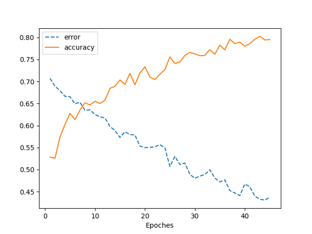
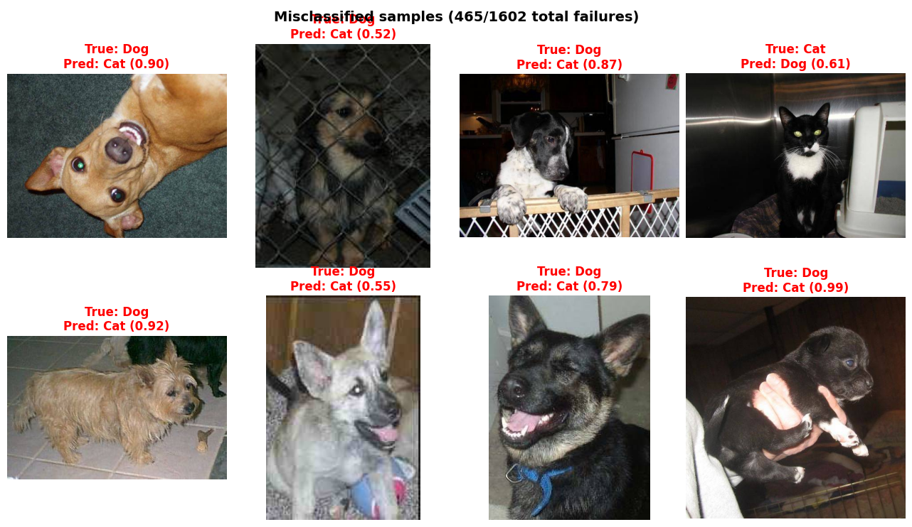
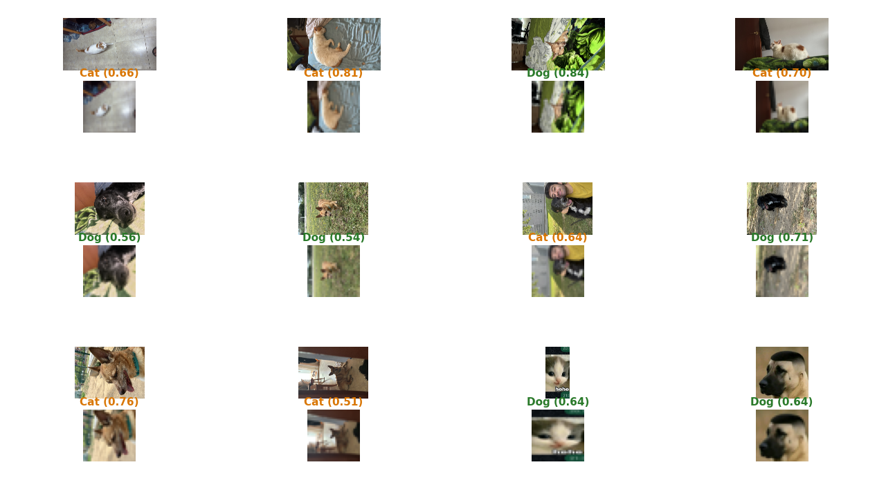

# CNN Image Classifier from Scratch

A convolutional neural network built entirely from scratch in NumPy, with no deep learning frameworks (no PyTorch, no TensorFlow). Every layer (convolution, max-pooling, dense, activations) implements its own forward and backward pass by hand, making this a transparent, educational project about how a CNN really works under the hood.


## What it does

Binary image classification on two datasets:

- **Pokémon vs. Digimon** (stylized sprites) → ~99% test accuracy. Trivial classification task due to small image sizes and clearly distinct visual styles, but useful for validating the pipeline.
- **Cats vs. Dogs** (real photographs from Kaggle) → ~0.70 test accuracy, a harder generalization problem with real-world images.


## Highlights

- **Fully hand-written forward propagation and backpropagation** for every layer, including the non-trivial cases: gradient routing through max-pool ties, and conv backward via `correlate2d` / `convolve2d`.
- **Modular layer API** with `forward` / `backward` / `get_params` / `set_params` that lets you compose architectures as a Python list, the same pattern the major frameworks expose.
- **Training utilities**: mini-epoch subsampling, `.npz` checkpointing every N epochs, and save/load of full model state.
- **Reproducible data pipeline**: deterministic train/test splits and undersampling indices saved to disk, class balancing, and optional augmentation (rotation, flip, brightness, saturation, jitter, noise, random erasing).
- **Numerically stable losses**: binary cross-entropy and MSE with clipped sigmoid and log-clipping to avoid NaN / overflow.


## Project structure

```
src/
├── layers/
│   ├── layer.py              # Base class (forward / backward interface)
│   ├── dense.py              # Fully connected layer with He initialization
│   ├── convolutional.py      # 2D convolution (scipy.signal)
│   ├── maxpool.py            # Max-pooling with correct gradient routing
│   ├── reshape.py            # Flatten and Reshape utilities
│   ├── activation.py         # Generic activation wrapper
│   └── activations.py        # Sigmoid, Tanh, ReLU, LeakyReLU
│
├── utils/
│   ├── training.py           # Training loop, save/load, predict
│   ├── testing.py            # Test evaluation with per-class examples
│   ├── preproces_datav1.py   # Image loading, augmentation, dataset builder
│   └── error.py              # Loss functions (BCE, MSE)
│
└── classifier_catdog.py      # Main script: data → architecture → train → test
```


## Architecture (Cats vs. Dogs)

```
Input (3, 32, 32)
  → Conv2D (8 filters, 3×3)   → LeakyReLU  → MaxPool (2×2)
  → Conv2D (16 filters, 3×3)  → LeakyReLU  → MaxPool (2×2)
  → Flatten (576)
  → Dense (576 → 64)          → LeakyReLU
  → Dense (64 → 1)            → Sigmoid
  → Binary Cross-Entropy Loss
```
### Results

At first I ran into a lot of overfitting: every epoch processed the entire image set (200 epochs total), and the model ended up overfitted. Final training accuracy was around 90%, while test accuracy stalled at about 60%. In other words, the network was memorizing the training images instead of learning generalizable patterns, which showed up as poor test performance.

To fix this I made two changes. First, I moved from 16×16 to 32×32 images and added a second convolutional layer to capture more features from the image. Second, I now sample a random subset of the training set at each epoch, to prevent the network from memorizing and push it toward actual learning. Testing different epoch counts together with early stopping, I found that the network converges at around ~50 epochs, with an accuracy of roughly 80%.



```
Test accuracy: 1137/1602 = 0.710
```
### Misclassified samples

To understand what the model struggles with, I visualized random failures from the test set at their original resolution.



Some patterns emerge from the misclassified images:

- **Dark-furred animals are problematic.** The model tends to classify dark or black cats as dogs and vice versa, suggesting it relies on color/brightness as a feature rather than shape (ears, snout, posture).
- **Busy backgrounds confuse the model.** When the animal appears against cluttered environments (furniture, patterned carpets, other objects), the 32×32 downscaling mixes the animal with the background and the model cannot isolate the relevant features.
- **Low confidence on failures.** Most misclassifications have prediction scores between 0.55 and 0.70, meaning the model is uncertain rather than confidently wrong. This suggests it has learned meaningful features but lacks the resolution to handle ambiguous cases.

## Testing on my own pets

I tested the trained model with photos of my own pets: Choko (a black dog), Toby (a small brown dog), and Noe (a white-brown, surprisingly small cat). I also included some memes and edited images to explore the model's behavior on out-of-distribution data.



Some observations:

- The network performs better on images where the pet appears against a **homogeneous background**. Clean, simple backgrounds let the model focus on the animal itself.
- When a **person appears in the frame** (e.g. me holding Choko), the model gets confused, likely because the extra visual information at 32×32 resolution overwhelms the animal features.
- Images with **text overlays or non-homogeneous crops** (e.g. screenshots from WhatsApp showing timestamps and UI elements) also cause failures.
- Even when the model fails on these edge cases, the prediction scores tend to hover around **0.55–0.70**, meaning the model is uncertain rather than confidently wrong. This suggests it has learned something meaningful but lacks the resolution and context to handle complex scenes.

Possible improvements include increasing the input resolution (SIZE=64), adding more training data, and applying data augmentation to make the model more robust to background clutter and color variation.


## Getting started

### Requirements

Python 3.8+ and three packages:

```bash
pip install numpy scipy pillow matplotlib
```

### Dataset setup

Download your images and place them with this structure:

```
datasets/
├── cat/       # cat photos (.jpg / .png)
├── dog/       # dog photos
├── pokemon/   # pokémon sprites
└── digimon/   # digimon sprites
```

The Cats vs. Dogs images come from the classic [Kaggle Dogs vs. Cats dataset](https://www.kaggle.com/c/dogs-vs-cats). Update the folder paths at the top of `classifier_catdog.py` to point to your dataset directories.

### Run

```bash
python src/classifier_catdog.py
```

The script loads and preprocesses images, trains the network, saves checkpoints every 5 epochs, and prints test accuracy at the end.


## Notes on overfitting

The Cats vs. Dogs task is a good illustration of overfitting on a limited dataset. Training the network for many epochs drives training accuracy to 100% while test accuracy stalls and then degrades: the model memorizes the training images instead of learning generalizable patterns. In practice the best test accuracy is reached fairly early (around epoch 45–50 in this setup), after which further training hurts generalization. Techniques to address this include early stopping, data augmentation (already implemented in the preprocessing pipeline), and regularization.

<!-- Include your overfitting graph here:

-->


## Tech

| Component | Library |
|-----------|---------|
| Linear algebra and array ops | NumPy |
| 2D convolution / correlation | SciPy (`scipy.signal`) |
| Image loading and resizing | Pillow |
| Plotting training curves | Matplotlib |
| Everything else | Written from scratch |


## License

MIT
